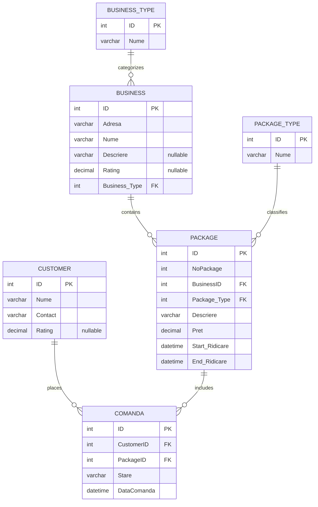

# Schema schematic for database test2

This ER diagram was derived from the tables in the test2 database.

```mermaid
erDiagram
    BUSINESS_TYPE {
        int ID PK
        varchar Nume
    }

    BUSINESS {
        int ID PK
        varchar Adresa
        varchar Nume
        varchar Descriere "nullable"
        decimal Rating "nullable"
        int Business_Type FK
    }

    CUSTOMER {
        int ID PK
        varchar Nume
        varchar Contact
        decimal Rating "nullable"
    }

    PACKAGE_TYPE {
        int ID PK
        varchar Nume
    }

    PACKAGE {
        int ID PK
        int NoPackage
        int BusinessID FK
        int Package_Type FK
        varchar Descriere
        decimal Pret
        datetime Start_Ridicare
        datetime End_Ridicare
    }

    COMANDA {
        int ID PK
        int CustomerID FK
        int PackageID FK
        varchar Stare
        datetime DataComanda
    }

    BUSINESS_TYPE ||--o{ BUSINESS : categorizes
    BUSINESS ||--o{ PACKAGE : contains
    PACKAGE_TYPE ||--o{ PACKAGE : classifies
    CUSTOMER ||--o{ COMANDA : places
    PACKAGE ||--o{ COMANDA : includes
```
